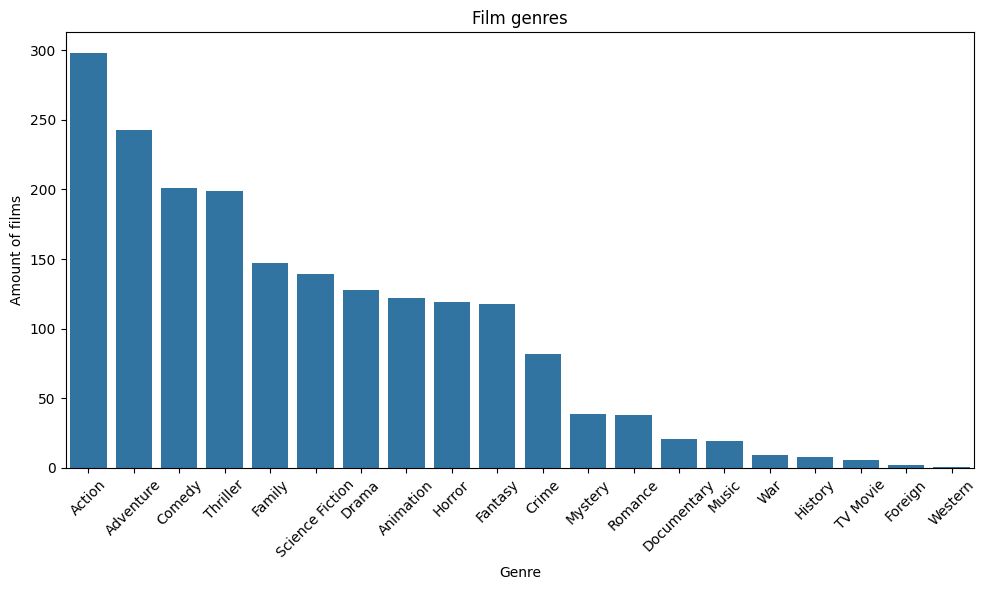

# Анализ даних кіноіндустрії

Просто програма яка аналізує дані про фільми, такі як прибуток, рік випуску, жанр і т.д., виводячи все це в різному виді.

## Дані

Використаний датасет мав 24 колонки і 45466 записів

Всі колонки:
- `adult`
- `belongs_to_collection`
- *`budget`*
- *`genres`*
- *`homepage`*
- `id`
- `imbd_id`
- `original_language`
- `original_title`
- `overview`
- `popularity`
- `poster_path`
- `production_companies`
- `production_countries`
- *`release_date`*
- *`revenue`*
- `runtime`
- `spoken_languages`
- `status`
- `tagline`
- *`title`*
- `video`
- `vote_average`
- `vote_count`

### Очищення даних

Видалено записи без даних. Написано "with out link" в пустих записах колонки `homepage`.

Зроблено нові колонки `release_year` і `revenue`

## Результат

### 1. Популярність жанрів

Цей графік демонструє кількість фільмів з кожним жанром:

### 2. Найбільші дані
- `runtime` = 476
- `vote_average` = 8.5
- `vote_count` = 12 269
- `revenue` = 2 787 965 000

-------------------------
## Як повторити аналіз (локально)

  1. 
  2. Натиснути `Open in Colab`
  3. Натиснути `Run all`

------------------------
## Контактна інформація

Не скажу
